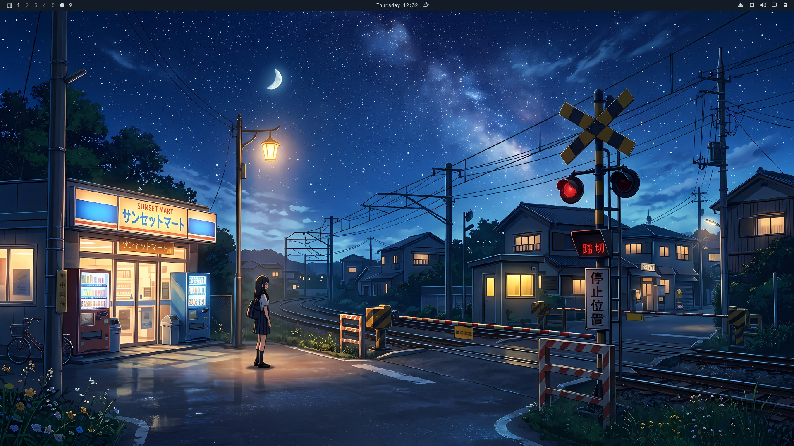
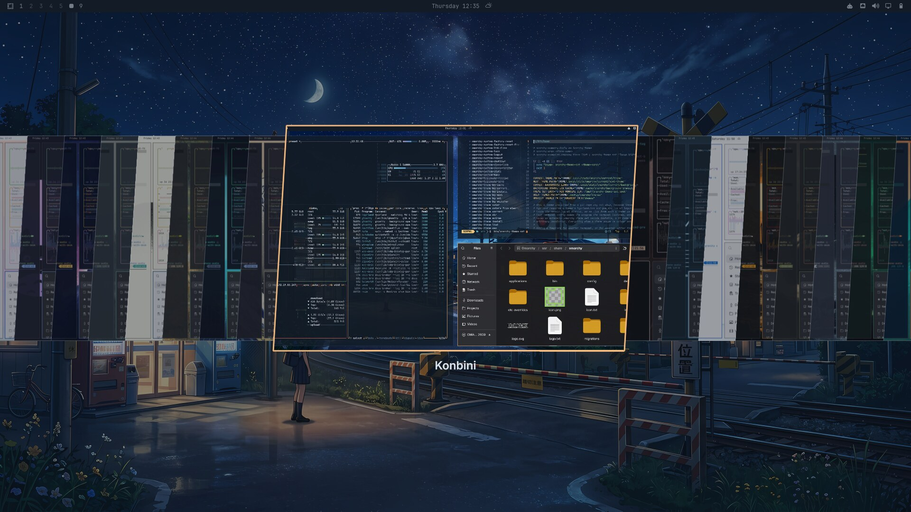
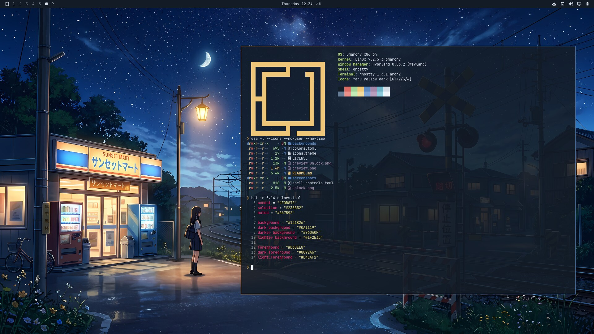
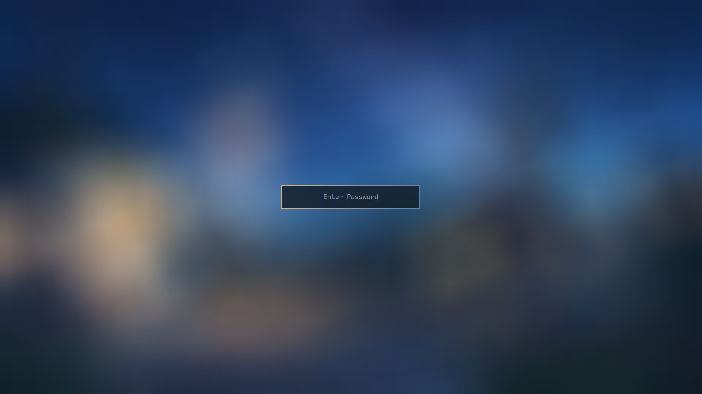
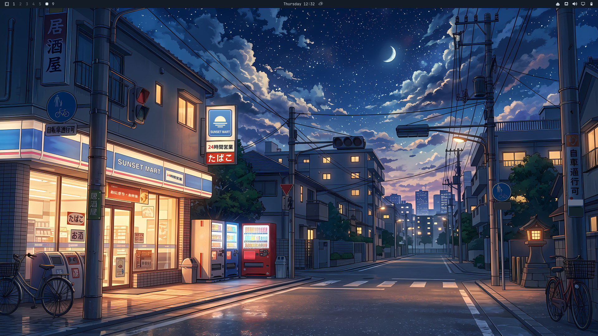
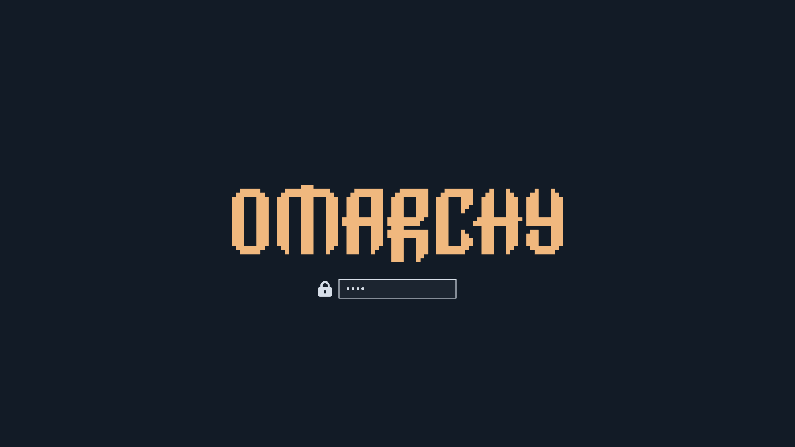

# Konbini

An [Omarchy](https://omarchy.org) theme for late nights, empty streets, and the
glow of a convenience store sign — inspired by quiet anime slice-of-life
backdrops. Deep navy night sky, warm amber window and streetlamp light, soft
starfields.



## Gallery

| | |
| --- | --- |
| <br>Theme picker | <br>Terminal + gradient border |
| <br>Lock screen | <br>Second wallpaper |
| <br>Boot / disk-unlock screen | |

## Install

**Option A — `omarchy theme install` (recommended):**

```bash
omarchy theme install https://github.com/Lohan-Pieterse/omarchy-konbini-theme.git
```

This clones the repo into `~/.config/omarchy/themes/konbini` and applies the
theme right away. As a security measure, Omarchy won't apply any `*.lua`,
terminal configs, or `vscode.json` from a theme cloned from git — this theme
doesn't ship any of those, so nothing is lost.

**Option B — manual clone**, if you want to inspect or tweak it first:

```bash
git clone https://github.com/Lohan-Pieterse/omarchy-konbini-theme.git \
  ~/.config/omarchy/themes/konbini
omarchy theme set konbini
```

A manual clone still has its `.git` directory, so Omarchy treats it exactly
like an installed theme: the same file filtering, and `omarchy theme update`
keeps it up to date.

**After installing**, cycle between the two wallpapers with:

```bash
omarchy theme bg next
```

## Palette

| Role       | Color                                                    | Hex       |
| ---------- | -------------------------------------------------------- | --------- |
| accent     |  | `#F0B87E` |
| background |  | `#121B26` |
| foreground |  | `#D6DEE8` |
| red        |  | `#DC6A62` |
| yellow     |  | `#F2C879` |
| orange     |  | `#EE9858` |
| green      |  | `#A4D497` |
| cyan       |  | `#6FB4C7` |
| blue       |  | `#5C89C2` |
| magenta    |  | `#A587A8` |
| brown      |  | `#8B6B52` |

Full values in [`colors.toml`](colors.toml).

## Backgrounds

Two wallpapers included under `backgrounds/` at a true 3840×2160 (4K). Both
were generated with Google's image generation AI at 1376×768, then upscaled
with Real-ESRGAN (`realesrgan-x4plus-anime`) for clean line art at full
resolution rather than a blurry stretch.

- `01-station-crossing.jpg` — a girl waiting at a rail crossing by a corner
  store. Shown first (Omarchy picks backgrounds alphabetically the first time
  a theme is applied).
  This is also the wallpaper behind the windows in `preview.png`.
- `02-corner-store.jpg` — the same fictional Sunset Mart, on a street corner
  under a starry sky.

The signage was repainted by hand after generation: real-world brand logos
were replaced with the fictional Sunset Mart, and garbled AI text on the
store signs, banners and crossing plates was replaced with real Japanese
(24時間営業, おにぎり・お弁当, 踏切注意, 年中無休).

## Lock screen

Nothing to configure — Omarchy's lock screen automatically blurs whichever
background is currently active and re-uses `hyprland_active_border` from
`colors.toml` for the password box outline, so it always matches. You can
safely preview it without actually locking your session:

```bash
omarchy shell lock preview      # show it
omarchy shell lock hidePreview  # dismiss it
```

## What's themed

- `colors.toml` — the full Omarchy color palette, including
  `hyprland_active_border`/`hyprland_inactive_border` for an amber-to-blue
  gradient window border
- `icons.theme` — Yaru-yellow, amber folders that match the shop-window
  glow
- `shell.controls.toml` — amber focus and selected states for buttons, tabs
  and dropdowns in the Omarchy shell (the rest of the shell is generated)
- `unlock.png` / `preview-unlock.png` — an amber Omarchy logo for the boot /
  disk-unlock screen; pick it under **Menu → Style → Unlock**
- `preview.png` — a real desktop screenshot (btop, neovim + neo-tree, and
  Files tiled together, matching the layout Omarchy's own stock themes use
  for their previews), shown in the Omarchy theme picker and on
  [themes.omarchy.org](https://themes.omarchy.org)
- Everything else (terminal apps, bar, lock screen, etc.) is generated
  automatically by Omarchy from `colors.toml`. The palette is tuned for
  legibility: every text color clears WCAG AA (4.5:1) on the background
  except `muted` (≈4:1, used for comments and autosuggestions), and red/green
  stay distinguishable with red-green color blindness

## License

Code (`colors.toml`, `shell.controls.toml`) is MIT licensed — see
[LICENSE](LICENSE). The background images are AI-generated (see
[Backgrounds](#backgrounds)); feel free to use them as personal desktop
backgrounds, but please don't resell them. The store names in the artwork are
fictional.

Made by [Lohan-Pieterse](https://github.com/Lohan-Pieterse).
