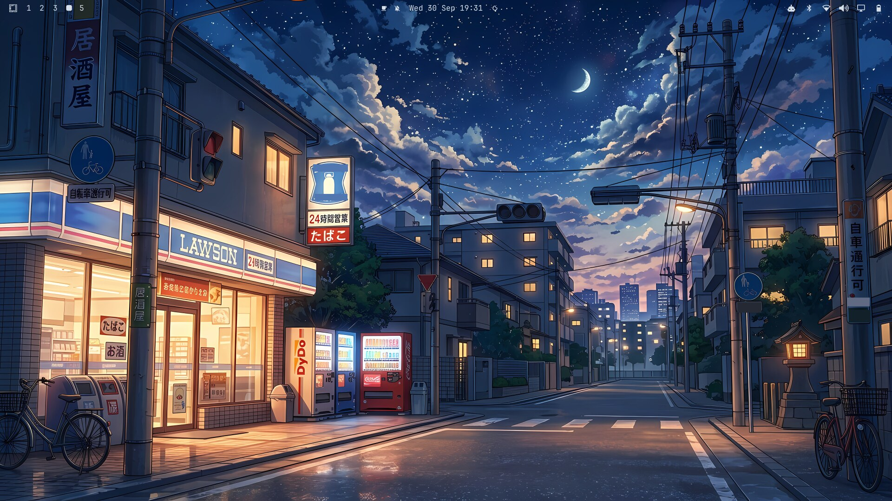

# Konbini

An [Omarchy](https://omarchy.org) theme for late nights, empty streets, and the
glow of a convenience store sign — inspired by quiet anime slice-of-life
backdrops. Deep navy night sky, warm amber window and streetlamp light, soft
starfields.


## Gallery

| | |
| --- | --- |
| <br>Theme picker | <br>Terminal + gradient border |
| <br>Lock screen | <br>Second wallpaper |

## Install

**Option A — `omarchy theme install` (recommended):**

```bash
omarchy theme install https://github.com/Lohan-Pieterse/omarchy-konbini-theme.git
```

This clones the repo into `~/.config/omarchy/themes/konbini` and applies the
theme right away. As a security measure, Omarchy won't apply any `*.lua`,
terminal configs, or `vscode.json` from a theme cloned from git — this theme
doesn't ship any of those, so nothing is lost.

**Option B — manual clone**, if you want to inspect or tweak it first:

```bash
git clone https://github.com/Lohan-Pieterse/omarchy-konbini-theme.git \
  ~/.config/omarchy/themes/konbini
omarchy theme set konbini
```

A manual clone still has its `.git` directory, so Omarchy treats it exactly
like an installed theme: the same file filtering, and `omarchy theme update`
keeps it up to date.

**After installing**, cycle between the two wallpapers with:

```bash
omarchy theme bg next
```

## Palette

| Role       | Color                                                    | Hex       |
| ---------- | -------------------------------------------------------- | --------- |
| accent     |  | `#F0B87E` |
| background |  | `#121B26` |
| foreground |  | `#D6DEE8` |
| red        |  | `#E0776B` |
| yellow     |  | `#F2C879` |
| orange     |  | `#F0A868` |
| green      |  | `#8FBF8A` |
| cyan       |  | `#6FB4C7` |
| blue       |  | `#5C89C2` |
| magenta    |  | `#A587A8` |
| brown      |  | `#8B6B52` |

Full values in [`colors.toml`](colors.toml).

## Backgrounds

Two wallpapers included under `backgrounds/` at a true 3840×2160 (4K). Both
were generated with Google's image generation AI at 1376×768, then upscaled
with Real-ESRGAN (`realesrgan-x4plus-anime`) for clean line art at full
resolution rather than a blurry stretch.

- `01-station-crossing.jpg` — a girl waiting at a rail crossing by a corner
  store. Shown first (Omarchy picks backgrounds alphabetically the first time
  a theme is applied).
- `02-lawson-corner.jpg` — a konbini storefront at dusk. This is the
  wallpaper behind the windows in `preview.png`.

The most noticeable spots of garbled AI signage text (a sign badge, a couple
of placards) were cleaned up by hand. Some smaller signs still contain
imperfect Japanese text.

## Lock screen

Nothing to configure — Omarchy's lock screen automatically blurs whichever
background is currently active and re-uses `hyprland_active_border` from
`colors.toml` for the password box outline, so it always matches. You can
safely preview it without actually locking your session:

```bash
omarchy shell lock preview      # show it
omarchy shell lock hidePreview  # dismiss it
```

## What's themed

- `colors.toml` — the full Omarchy color palette, including
  `hyprland_active_border`/`hyprland_inactive_border` for an amber-to-blue
  gradient window border
- `icons.theme` — Yaru-blue-dark, to match the navy/amber palette
- `preview.png` — a real desktop screenshot (btop, neovim + neo-tree, and
  Files tiled together, matching the layout Omarchy's own stock themes use
  for their previews), not just the raw wallpaper — shown in the Omarchy
  theme picker and on the [Omarchy themes site](https://omarchy.org/themes/),
  if submitted
- Everything else (terminal apps, bar, lock screen, etc.) is generated
  automatically by Omarchy from `colors.toml`

## License

Code (`colors.toml`) is MIT licensed — see [LICENSE](LICENSE).
The background images are AI-generated (see [Backgrounds](#backgrounds)); feel
free to use them as personal desktop backgrounds, but please don't resell
them. Brand names and logos visible in the artwork (Lawson, DyDo, Coca-Cola)
belong to their respective owners; this theme is not affiliated with or
endorsed by them.

Made by [Lohan-Pieterse](https://github.com/Lohan-Pieterse).
