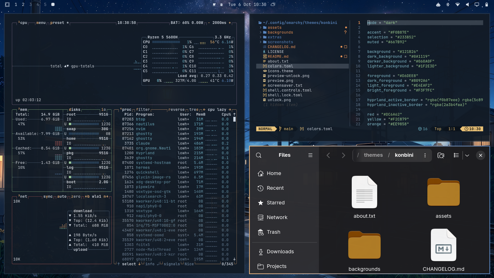
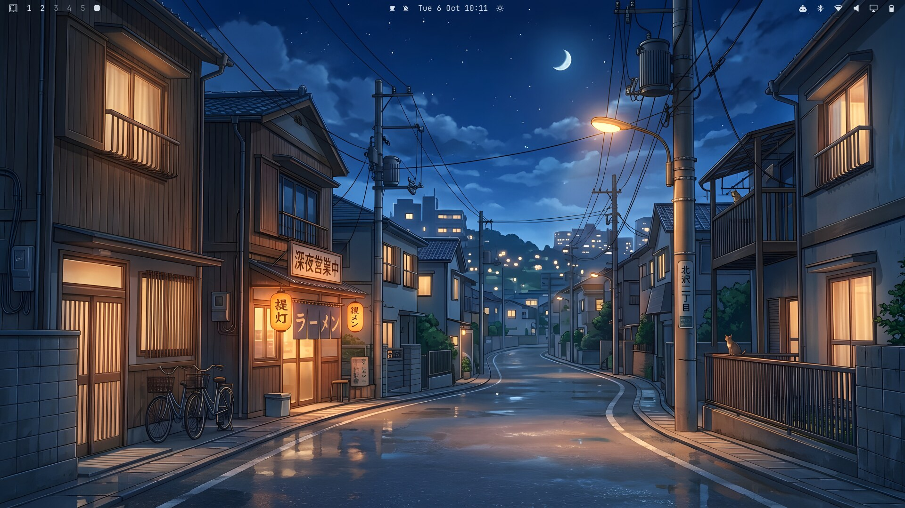
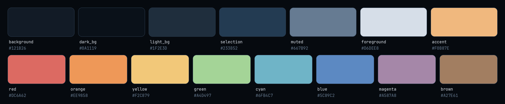
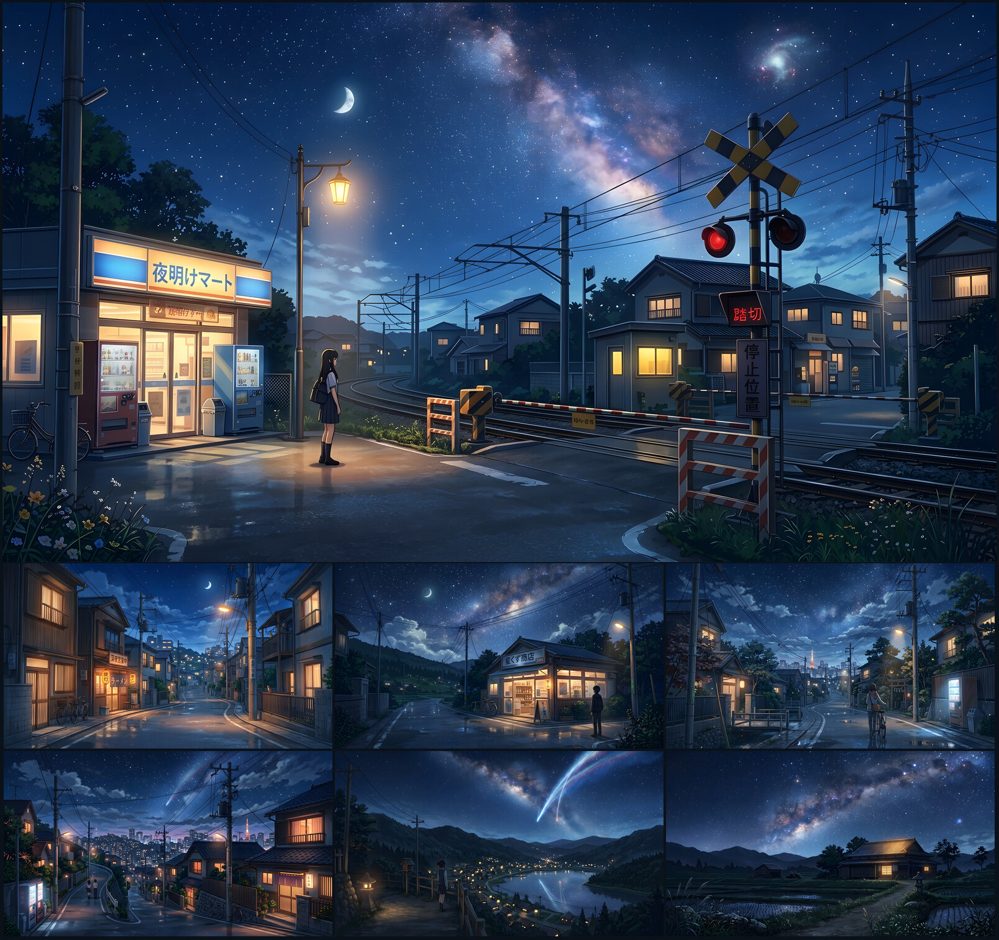

# Konbini

An [Omarchy](https://omarchy.org) theme for late nights, empty streets, and the
glow of a convenience store sign — inspired by quiet anime slice-of-life
backdrops. Deep navy night sky, warm amber window and streetlamp light, soft
starfields.



- **Seven 4K wallpapers**: painted late-night scenes, from a 24-hour corner
  shop and a ramen stand to a level crossing and a lakeside village
- **A tuned palette**: text colors pass WCAG AA (only the dimmed `muted`
  sits just below), and red and green stay apart for color-blind eyes
- **The whole Omarchy desktop**: amber-to-blue gradient borders, a matching
  lock screen, shell focus states, amber folder icons and an amber boot/unlock
  logo; terminals, Neovim, VS Code, btop and Chromium follow the palette too
- **An away screen**: a block-art night lane for the idle screensaver
- **Extras for Zed, Discord, Firefox, Spotify, cava, GTK4/libadwaita apps,
  Starship and lazygit**

## Gallery

| | |
| --- | --- |
| <br>`01-dawn-mart` | <br>`02-ramen-street` |
| <br>Terminal + gradient border | <br>Lock screen |
| <br>Theme picker | <br>Boot / disk-unlock screen |

## Install

**Option A — `omarchy theme install` (recommended):**

```bash
omarchy theme install https://github.com/Lohan-Pieterse/omarchy-konbini-theme.git
```

This clones the repo into `~/.config/omarchy/themes/konbini` and applies the
theme right away. As a security measure, Omarchy won't apply any `*.lua`,
terminal configs, or `vscode.json` from a theme cloned from git — this theme
doesn't ship any of those, so nothing is lost.

**Option B — manual clone**, if you want to inspect or tweak it first:

```bash
git clone https://github.com/Lohan-Pieterse/omarchy-konbini-theme.git \
  ~/.config/omarchy/themes/konbini
omarchy theme set konbini
```

A manual clone still has its `.git` directory, so Omarchy treats it exactly
like an installed theme: the same file filtering, and `omarchy theme update`
keeps it up to date.

Konbini needs **Omarchy 4.0 or newer** (tested on 4.0.4). It ships no
per-app config files: Omarchy generates them from `colors.toml`, so older
releases that need per-app theme files (`alacritty.toml`, `waybar.css`, …)
aren't supported.

**After installing**, cycle through the seven wallpapers with:

```bash
omarchy theme bg next
```

**Updating and removing:**

```bash
omarchy theme update            # pull the latest Konbini (and other git themes)
omarchy theme remove konbini    # uninstall
```

If you use the screensaver hook below, run its `omarchy hook install` line
again after an update so you get the latest version. To uninstall it, delete
`~/.config/omarchy/hooks/theme-set.d/screensaver-hook`.

## Palette



Contrast against the `#121B26` background (WCAG AA for body text is 4.5:1):

| Color | Hex | Contrast | | Color | Hex | Contrast |
|---|---|---|---|---|---|---|
| foreground | `#D6DEE8` | 12.8:1 | | green | `#A4D497` | 10.3:1 |
| accent | `#F0B87E` | 9.8:1 | | cyan | `#6FB4C7` | 7.5:1 |
| yellow | `#F2C879` | 11.0:1 | | magenta | `#A587A8` | 5.5:1 |
| orange | `#EE9858` | 7.7:1 | | red | `#DC6A62` | 5.2:1 |
| blue | `#5C89C2` | 4.8:1 | | brown | `#A27E61` | 4.7:1 |
| muted | `#667B92` | 4.0:1 | | | | |

Full values in [`colors.toml`](colors.toml).

## Backgrounds

Seven wallpapers are included under `backgrounds/`, all 3840×2160 (4K):



| File | Scene |
|---|---|
| `01-dawn-mart.jpg` | A girl waiting at a level crossing beside 夜明けマート, a corner convenience store. Shown first (Omarchy picks backgrounds alphabetically the first time a theme is applied), and the one behind the windows in `preview.png` |
| `02-ramen-street.jpg` | A late-night ramen stand on a quiet residential street, with a cat on the railing |
| `03-stardust-shop.jpg` | 星くず商店, a small 24-hour shop on a country road under the Milky Way |
| `04-tower-lane.jpg` | Walking a bicycle home past a shrine gate, with the city and a lit tower in the distance |
| `05-hillside-city.jpg` | A hillside lane above the city lights, with a shooting star overhead |
| `06-lakeside.jpg` | Looking down on a lakeside village from a lantern-lit path, under a comet |
| `07-farmhouse.jpg` | A farmhouse among flooded rice fields beneath the Milky Way |

The wallpapers were created with Google Gemini and upscaled to
4K with Real-ESRGAN. The shop names are fictional.

## Lock screen

Nothing to configure — Omarchy's lock screen automatically blurs whichever
background is currently active, and `shell.lock.toml` gives the password box
the same amber-to-blue gradient outline as your windows. You can safely
preview it without actually locking your session:

```bash
omarchy shell lock preview      # show it
omarchy shell lock hidePreview  # dismiss it
```

## Away screen (optional)

Konbini ships an idle screensaver, `screensaver.txt`: a quiet lane
in solid blocks (houses, a power line, a crescent moon
and stars), drawn in by Omarchy's text effects in place of the stock logo.
It is 66×17, so it fits the screensaver terminal even on small HiDPI
screens. Omarchy picks the effect and its colors at random each cycle;
themes can't change those. Omarchy keeps the screensaver
in your personal branding rather than in the theme, so it takes one step:

```bash
# Just use it:
cp ~/.config/omarchy/themes/konbini/screensaver.txt ~/.config/omarchy/branding/screensaver.txt

# Or swap it in automatically: any theme that ships a screensaver.txt
# (like Konbini) gets its own away screen, and yours comes back when you
# switch to a theme that doesn't ship one:
omarchy hook install theme-set ~/.config/omarchy/themes/konbini/extras/screensaver-hook
omarchy theme set konbini   # run the hook once now
```

The same hook also swaps in a matching fastfetch logo (`about.txt`, shown by
`omarchy launch about` / the Omarchy menu's "About" entry) and restores your
own when you switch to a theme that doesn't ship one.

Preview it with `omarchy launch screensaver force`; any key ends it.

## Extras for other apps

Optional themes for apps Omarchy doesn't theme itself. Nothing here is
applied automatically.

| App | File | How to install |
|---|---|---|
| Zed | `extras/zed/konbini.json` | `mkdir -p ~/.config/zed/themes && ln -sf ~/.config/omarchy/themes/konbini/extras/zed/konbini.json ~/.config/zed/themes/konbini.json` then pick "Konbini" in Zed's theme selector |
| Discord (Vencord/Vesktop) | `extras/vencord/konbini.theme.css` | `ln -sf ~/.config/omarchy/themes/konbini/extras/vencord/konbini.theme.css ~/.config/vesktop/themes/konbini.theme.css` then enable it in Vencord Settings → Themes |
| cava | `extras/cava/konbini` | copy all the lines from `~/.config/omarchy/themes/konbini/extras/cava/konbini` into the `[color]` section of `~/.config/cava/config` |
| Firefox | `extras/firefox/userChrome.css` | set `toolkit.legacyUserProfileCustomizations.stylesheets` to `true` in `about:config`, then `mkdir -p <profile>/chrome && ln -sf ~/.config/omarchy/themes/konbini/extras/firefox/userChrome.css <profile>/chrome/userChrome.css` |
| Spotify (Spicetify) | `extras/spotify/color.ini` | `mkdir -p ~/.config/spicetify/Themes/Konbini && cp ~/.config/omarchy/themes/konbini/extras/spotify/color.ini ~/.config/spicetify/Themes/Konbini/ && spicetify config current_theme Konbini color_scheme Konbini && spicetify apply` |
| GTK4 / libadwaita apps | `extras/gtk/gtk.css` | `mkdir -p ~/.config/gtk-4.0 && ln -sf ~/.config/omarchy/themes/konbini/extras/gtk/gtk.css ~/.config/gtk-4.0/gtk.css` (back up an existing `gtk.css` first; it stays Konbini after you switch themes) |
| Starship | `extras/starship/starship.toml` | back up any existing prompt, then `cp ~/.config/omarchy/themes/konbini/extras/starship/starship.toml ~/.config/starship.toml` |
| lazygit | `extras/lazygit/config.yml` | merge the `gui: theme:` block into `~/.config/lazygit/config.yml` |

## What's themed

- `colors.toml` — the full Omarchy color palette, including
  `hyprland_active_border`/`hyprland_inactive_border` for an amber-to-blue
  gradient window border
- `icons.theme` — Yaru-yellow, amber folders that match the shop-window
  glow
- `shell.controls.toml` — amber focus and selected states for buttons, tabs
  and dropdowns in the Omarchy shell (the rest of the shell is generated)
- `shell.lock.toml` — the amber-to-blue gradient on the lock screen's
  password box
- `unlock.png` / `preview-unlock.png` — an amber Omarchy logo for the boot /
  disk-unlock screen; pick it under **Menu → Style → Unlock**
- `about.txt` — fastfetch logo: a small block-art konbini storefront and
  crescent moon for the "About" screen, swapped in by `extras/screensaver-hook`
- `preview.png` — a real desktop screenshot (btop, neovim + neo-tree, and
  Files tiled together, matching the layout Omarchy's own stock themes use
  for their previews), shown in the Omarchy theme picker and on
  [omarchy.org/themes](https://omarchy.org/themes/)
- Everything else is generated by Omarchy from `colors.toml`, so these
  pick up the Konbini palette with nothing to install: Ghostty, Alacritty,
  Kitty and foot, Neovim, VS Code, btop, Chromium/Brave, Obsidian, Helix,
  Hyprland, the Omarchy shell (bar, launcher, menus,
  notifications, lock screen) and RGB keyboards. The palette is tuned for
  legibility: every text color clears WCAG AA (4.5:1) on the background
  except `muted` (≈4:1, used for comments and autosuggestions), and red/green
  stay distinguishable with red-green color blindness

Because Konbini ships only palette, image and shell-override files, and none of
the per-app configs Omarchy regenerates, Omarchy updates that change those
templates carry over to Konbini automatically.

## License

The theme files (`colors.toml`, `icons.theme`, the `shell.*.toml` files,
`screensaver.txt`, `about.txt`, `extras/` and `assets/`) are MIT licensed —
see [LICENSE](LICENSE). Feel free to use the backgrounds as personal desktop
backgrounds, but please don't resell them (see [Backgrounds](#backgrounds) for
how they were made).

Release notes are in [CHANGELOG.md](CHANGELOG.md).

Made by Lohan Pieterse ([@Lohan-Pieterse](https://github.com/Lohan-Pieterse)).
